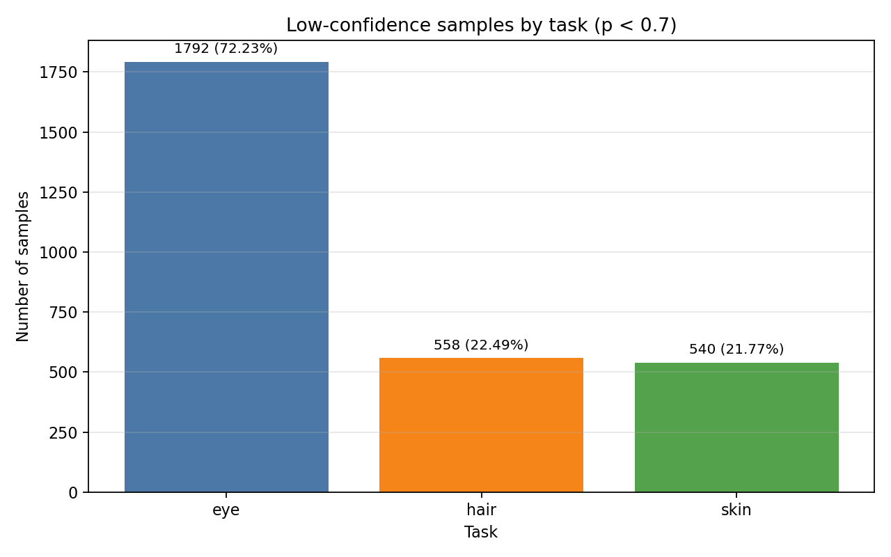
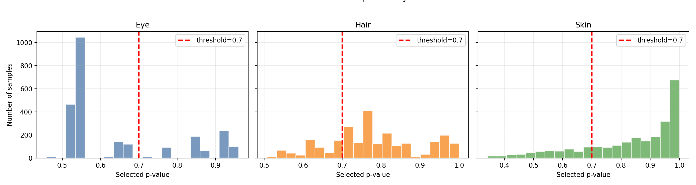

# EVC Dataset 

## Overview

This EVC-FDP dataset includes:

1. `hirisplex_results_FN_v2.csv` (source data in HiRISPlex-style output format)
2. `full_dataset.csv` (ML-ready dataset: SNP features + labels)

---

## 1) Source dataset: `hirisplex_results_FN_v2.csv`

- Shape: **(2504, 45)**
- Contains **23 samples with missing `input_csv`**

### Key structure

- `sample`: sample identifier
- `input_csv`: a 2-line CSV string stored in one cell
  - line 1: SNP names
  - line 2: SNP dosage values (typically 0/1/2), total 41 SNPs
- Trait result groups for `i = 0..13`:
  - `result/i/trait`
  - `result/i/p_value`
  - `result/i/auc_loss`
- `error`: optional error information (often empty)

### Trait index groups

- Eye: `result/0..2/*`  
  (blue eye, intermediate eye, brown eye)
- Hair: `result/3..8/*`  
  (blond hair, brown hair, red hair, black hair, light hair, dark hair)
- Skin: `result/9..13/*`  
  (very pale skin, pale skin, intermediate skin, dark skin, dark to black skin)

---

## 2) Training dataset: `full_dataset.csv`

- Shape: **(2481, 44)**
- Built from samples with valid `input_csv`

### Column structure

- Feature columns: `snp_0` ... `snp_40` (41 SNP features)
- Label columns:
  - `eye` (0..2)
  - `hair` (0..5)
  - `skin` (0..4)

### Label assignment in EVC

Labels are assigned using `argmax` on grouped `p_value` fields:

- `eye = argmax(probs[:, 0:3])`
- `hair = argmax(probs[:, 3:9])`
- `skin = argmax(probs[:, 9:14])`

---

## 3) Confidence analysis (threshold)

Goal: assess how confident argmax-selected labels are.

- `selected p-value` = max probability in each task group
- low-confidence at threshold 0.7: `selected_p < 0.7`

### Low-confidence results at threshold = 0.7

- Eye: **1792** samples (**72.23%**)
- Hair: **558** samples (**22.49%**)
- Skin: **540** samples (**21.77%**)

---

## 4) Visualizations

### Low-confidence by task (threshold = 0.7)

### Histogram of selected p-values by task

---

## 5) Notes

1. `input_csv` contains embedded newlines inside quoted text, so always use a robust CSV parser (e.g., pandas).
2. `p_value` is used as confidence when assigning labels with `argmax`.
3. Higher thresholds (e.g., 0.75+) increase confidence but reduce coverage.
