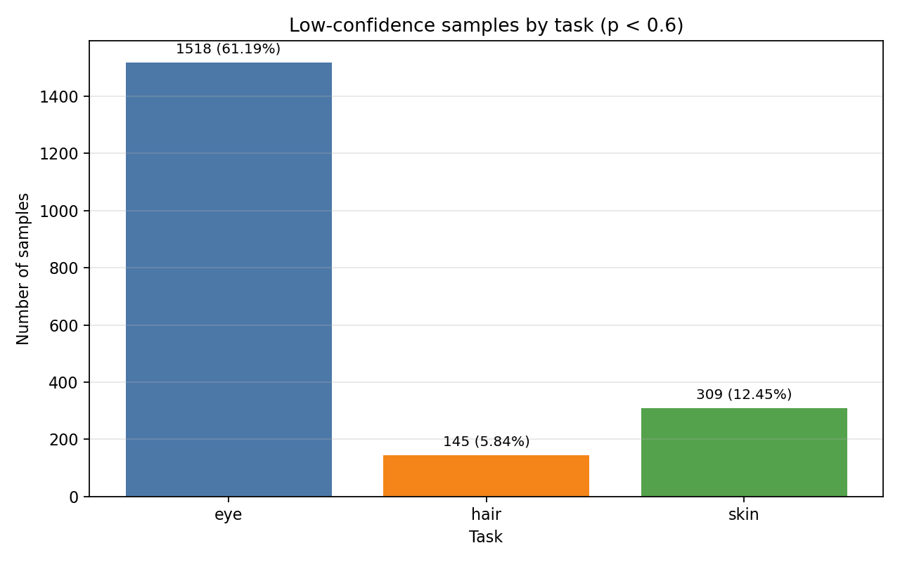
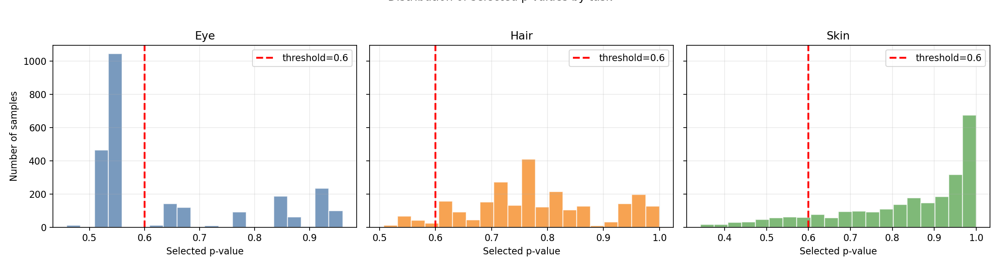

# EVC Dataset

## Tổng quan

This EVC-FDP dataset includes:

1. `hirisplex_results_FN_v2.csv` (dataset nhãn suy diễn, dạng HiRISPlex output)
2. `full_dataset.csv` (dataset đã chuẩn hóa cho ML: SNP features + nhãn)

---

## 1) Dataset nguồn: `hirisplex_results_FN_v2.csv`

- Kích thước: **(2504, 45)**
- Có **23 sample thiếu `input_csv`**

### Cấu trúc

- `sample`: mã mẫu
- `input_csv`: chuỗi 2 dòng trong 1 ô CSV
  - dòng 1: tên SNP
  - dòng 2: giá trị dosage SNP (thường 0/1/2), tổng 41 SNP
- Nhóm kết quả trait cho `i = 0..13`:
  - `result/i/trait`
  - `result/i/p_value`
  - `result/i/auc_loss`
- `error`: thông tin lỗi (thường rỗng)

### Nhóm trait theo index

- Eye: `result/0..2/*`  
  (blue eye, intermediate eye, brown eye)
- Hair: `result/3..8/*`  
  (blond hair, brown hair, red hair, black hair, light hair, dark hair)
- Skin: `result/9..13/*`  
  (very pale skin, pale skin, intermediate skin, dark skin, dark to black skin)

---

## 2) Dataset huấn luyện: `full_dataset.csv`

- Kích thước: **(2481, 44)**
- Được tạo từ các sample có `input_csv` hợp lệ

### Cấu trúc cột

- Feature columns: `snp_0` ... `snp_40` (41 SNP features)
- Label columns:
  - `eye` (0..2)
  - `hair` (0..5)
  - `skin` (0..4)

### Cách gán nhãn trong EVC

Selected label = label có giá trị `p-value` lớn nhất trong từng nhóm trait tương ứng (Eye/Hair/Skin).

Nhãn được lấy bằng `argmax` trên `p_value` theo từng nhóm:

- `eye = argmax(probs[:, 0:3])`
- `hair = argmax(probs[:, 3:9])`
- `skin = argmax(probs[:, 9:14])`

---

## 3) Phân tích confidence (threshold)

Mục tiêu: kiểm tra mức “chắc chắn” của nhãn lấy bằng `argmax`.

- `selected p-value` = giá trị lớn nhất trong group trait của mỗi task
- low-confidence (ở ngưỡng 0.6): `selected_p < 0.6`

### Kết quả low-confidence với threshold = 0.6

- Eye: **1518** mẫu (**61.19%**)
- Hair: **145** mẫu (**5.84%**)
- Skin: **309** mẫu (**12.45%**)

---

## 4) Biểu đồ trực quan

### Low-confidence theo từng task (threshold = 0.6)

### Histogram phân bố selected p-value theo task

---

## 5) Ghi chú

1. `input_csv` có newline trong chuỗi quoted -> luôn dùng parser CSV chuẩn (ví dụ pandas).
2. `p_value` được dùng làm độ tin cậy khi gán nhãn bằng `argmax`.
3. Với ngưỡng cao (0.75+), độ chắc chắn tăng nhưng độ phủ giảm.
